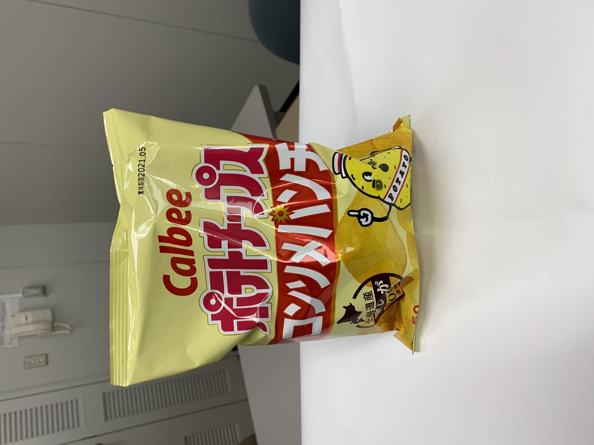
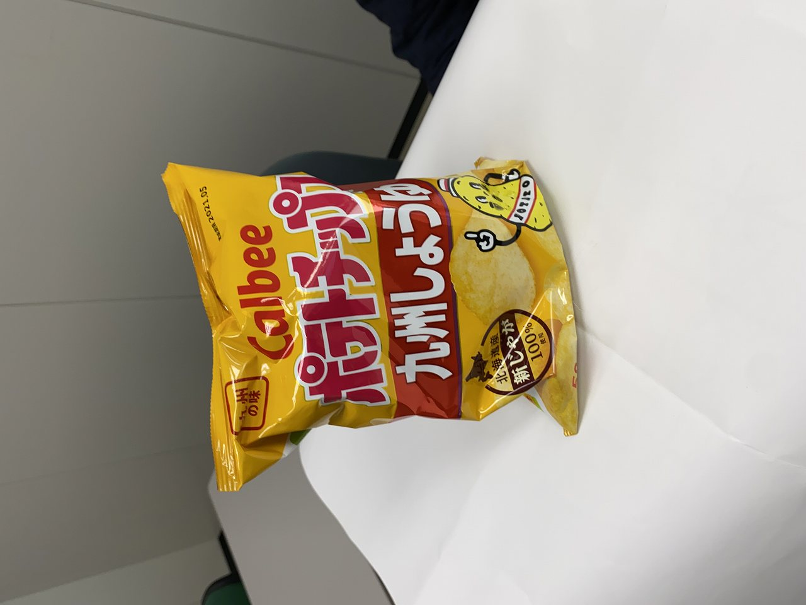
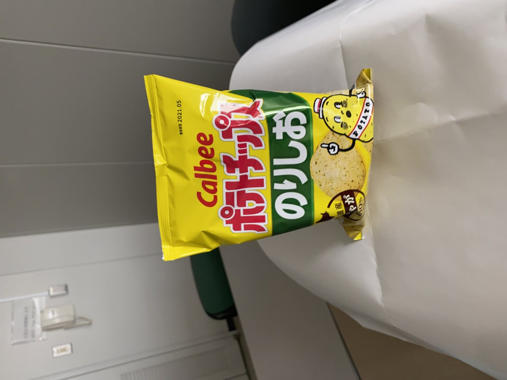
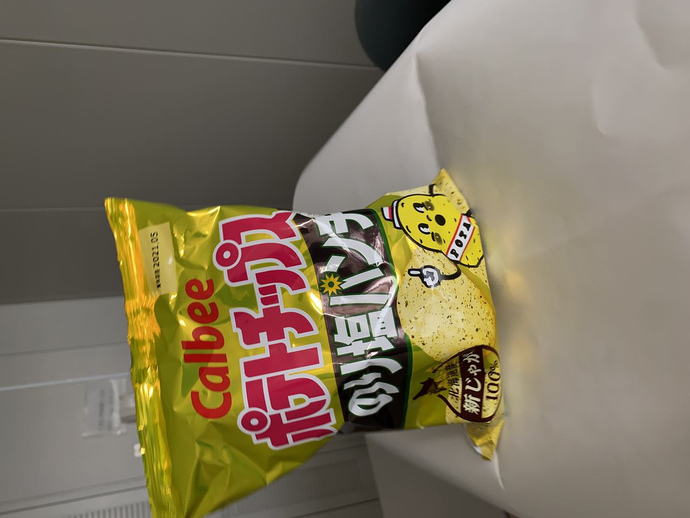
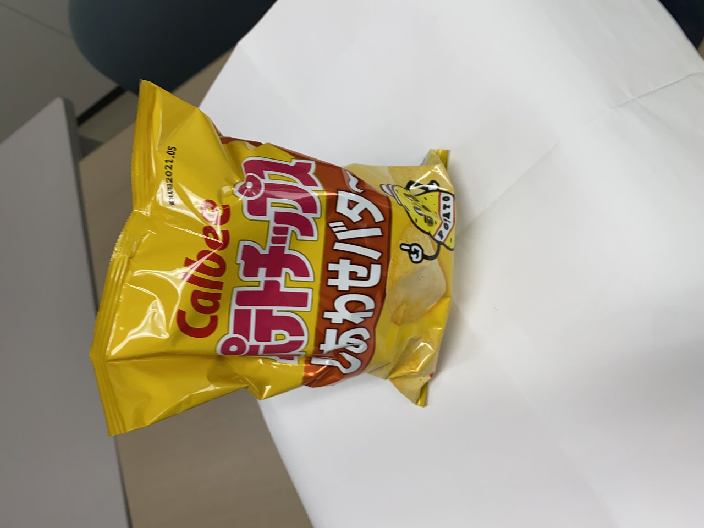
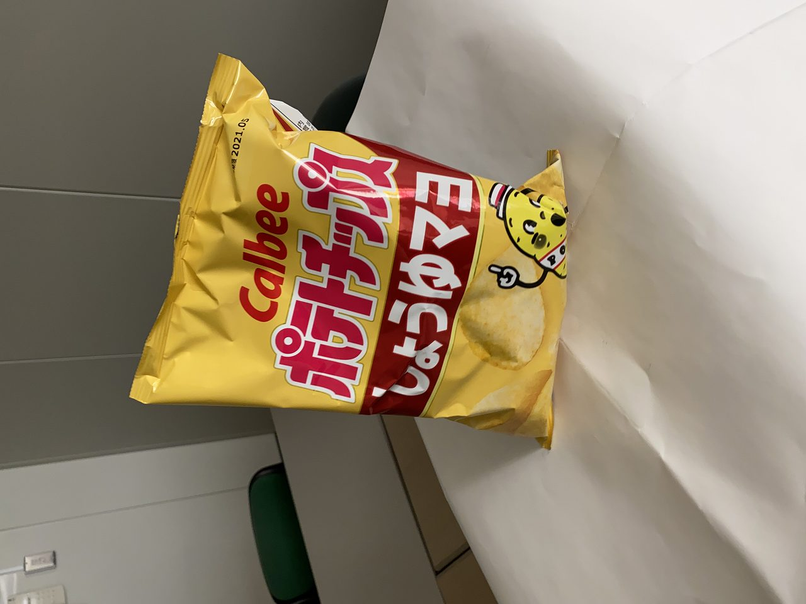
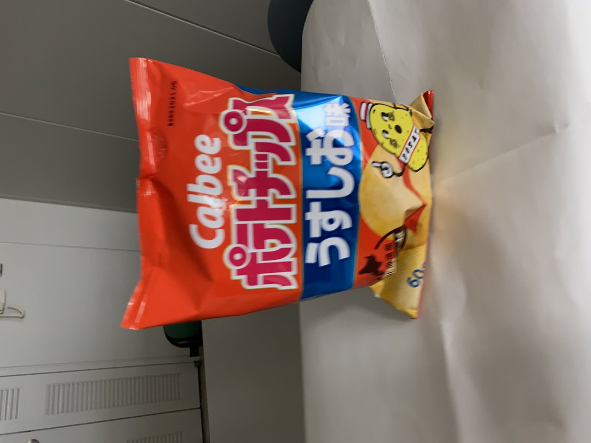

# SAGA Smart Hackathon

## 問題

与えられたデータセットを用いて画像の **7 クラス 分類** (`Image Classification`) を行うモデルを作成してください。

### 留意点

- ネットワークの訓練には必ず学習用データセットのみを用いてください。
- データセットは分けていません。学習用、検証用、テスト用とご自身で分けてください
    - 学習時: 学習用、検証用
    - 最後の確認時: テスト用
- テスト用のデータセットは、ハッカソンの最後でご自身で実行ください

## データセット

データセットのURL:

```bash

```

ダウンロードしたファイルを解凍すると、`potato-chips` というフォルダに以下のようにファイルが入っています。

```
potato-chips
|
|-- consomme-punch
|   |-- IMG_9236.jpg
|   |-- IMG_9237.jpg
|   |-- IMG_9238.jpg
|   |-- ...
|-- kyusyu-shoyu
|   |-- IMG_8352.jpg
|   |-- IMG_8353.jpg
|   ...

```

- `potato-chips` 以下には、分類したいディレクトリ毎に画像ファイルがあります。
- ディレクトリ名を分類用のラベルとして利用してください。

画像のサンプルは以下のようになっています。

| Class ID | Sample image                                                            |
| :------- | :---------------------------------------------------------------------: |
| consomme-punch        |  |
| kyusyu-shoyu        |  |
| norishio        |  |
| norishio-punch        |  |
| shiawase-butter        |  |
| shoyu-mayo        |  |
| usushio        |  |
